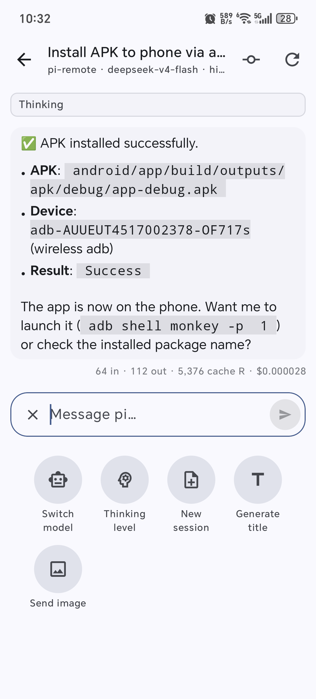
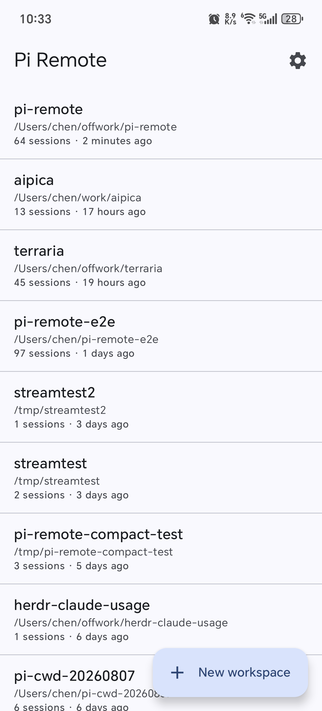
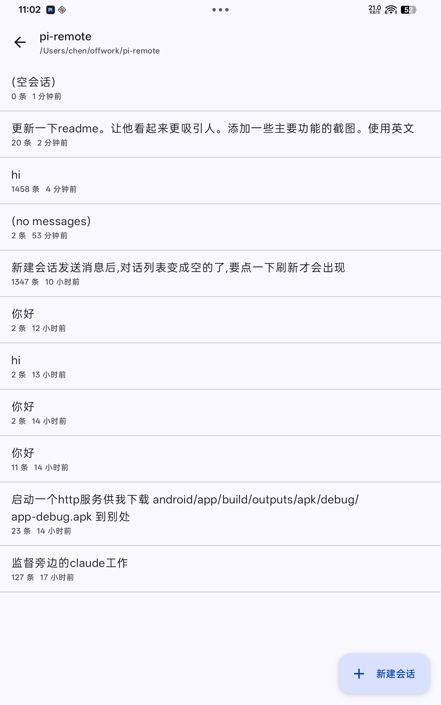
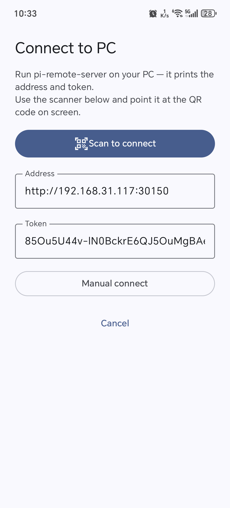

# Pi Remote 📱💻

> **Drive your local [pi](https://github.com/nicedoc/pi) coding agent from your phone — anywhere on the LAN.**

A native **Android app (Kotlin + Jetpack Compose)** that talks to a featherweight **Node.js bridge** on your PC. Browse every session, watch the agent work in real time, and steer it — all from the couch.

<p align="center">
  
  
  
</p>

<p align="center"><em>Connect once → browse everything → chat live. Your agent, in your pocket.</em></p>

---

## ✨ Features

| | |
|---|---|
| 📂 **Projects & Sessions** | Every session on your PC, grouped by working directory — open any one and read its full history instantly |
| ⚡ **Zero-cost browsing** | History is read straight from disk (JSONL). Switching sessions is instant — no agent is spawned just to look |
| 💬 **Live chat** | Streaming responses, thinking blocks, tool calls with **live output**, and per-round token usage |
| ⏹️ **Interrupt & queue** | Stop a running agent with one tap — or send a follow-up that queues politely behind it (`steer` / `followUp`) |
| 🆕 **Per-session model** | Each session picks its own model & thinking level independently, switchable mid-flight |
| 🖼️ **Image attachments** | Attach screenshots or photos to a prompt, preview the strip, and zoom into full-size results |
| 🌿 **Git at a glance** | Uncommitted changes and commit history with per-file / per-commit diffs, rendered as adaptive tables |
| 🔔 **Background agent** | Leave the app while the agent grinds — a completion notification taps you straight back into the session |
| 👥 **Multi-device live sync** | Several phones can watch the same session; new messages appear on every screen in real time |
| 🌙 **Dark Material 3** | A polished dark-first UI, single-column on phones |

---

## 🚀 Quick Start

### 1 · PC server (one command)

```bash
cd server
npm install
npm start        # listens on 0.0.0.0:30150
```

First launch prints the connection info and auto-generates a token, along with a **QR code** to pair the phone in one scan:

```
pi-remote-bridge 0.1.0
  URL:   http://192.168.31.117:30150
  Token: 85Ou5U44v-lN0BckrE6QJ5OuMgBAekZQ
  Listening on all interfaces — only use this on a trusted network.

  Scan with Pi Remote (app → 扫码连接):
  ▄▄▄▄▄▄▄ ▄ ▄   ▄  ▄▄▄  ▄▄▄▄  ▄  ▄  ▄▄▄▄▄▄▄
  █ ▄▄▄ █ ▄▀▄▄█   ▀▄ ▄█▀███▄ █▄▄ █  █ ▄▄▄ █
  █▄▄▄▄▄█ █ ▄▀▄ ▄ █ ▄▀▄▀█▀▄▀█ █▀▄ ▄ █▄▄▄▄▄█
  ...
```

The token lives at `~/.pi/remote/token` (mode `600`) and survives restarts.

### 2 · Android app

```bash
cd android
./gradlew installDebug        # installs on a connected device
```

Or side-load the ready-made APK at `android/app/build/outputs/apk/debug/app-debug.apk`.

**First launch:** tap **扫码连接** and point the camera at the QR code the server printed — the address and token fill in automatically and the connection is verified before saving. Manual entry (地址 + token) remains available as a fallback.

> **Build note:** Requires JDK 17 — make sure `JAVA_HOME` points at a JDK 17 (Gradle picks it up automatically).

---

## ⚙️ Automatic builds (GitHub Actions)

Two workflows live in `.github/workflows/`:

| Workflow | Trigger | What it does |
|---|---|---|
| `npm-publish.yml` | push a `v*` tag | typecheck + test, then publishes `pi-remote-bridge` to npm (version synced to the tag) |
| `android-build.yml` | push / PR / manual | runs unit tests, builds a **signed release APK** when keystore secrets are set (falls back to debug), uploads it as an artifact — and attaches it to the GitHub Release on `v*` tags |

- npm publishing needs an **`NPM_TOKEN`** repository secret (npm access token).
- Signed APK releases need four repository secrets: **`KEYSTORE_BASE64`** (the keystore file, base64-encoded), **`KEYSTORE_PASSWORD`**, **`KEY_ALIAS`**, **`KEY_PASSWORD`**. Without them the workflow still runs but ships the debug APK instead.
- Tag `v0.2.0` → publishes `pi-remote-bridge@0.2.0` and a release with the APK attached.

---

## 📸 Screenshots

| | |
|---|---|
|  | **Live chat** — streaming response, thinking block, bash tool call with live output, token usage per round |
|  | **Projects browser** — sessions grouped by working directory with counts & last activity |
|  | **Session list** — preview, message count, and relative time for every session |
|  | **One-time setup** — address + token, verified before saving |

---

## 🏗 Architecture

```
server/     Node + TypeScript bridge service   →  server/AGENTS.md
android/    Kotlin + Compose app               →  android/AGENTS.md
plan.md     Design decisions & tradeoffs
```

> Both `AGENTS.md` files document real-world data and pitfalls encountered during development — **read them before touching the code.**

### The one-liner

**Browsing is file-based. Execution spins up an agent on demand.**

Session lists and history are read directly from `~/.pi/agent/sessions/` JSONL files — no `AgentSession` is created just to browse, so switching sessions has **zero startup cost**. An agent is only instantiated when you actually send a message, and it's recycled after 10 minutes of idle time.

Since pi itself has no network capability (only stdin/stdout RPC and a Node SDK), the PC-side bridge service is essential.

---

## 🗺️ Roadmap

Ideas beyond the current scope:

- [ ] Extension dialog forwarding
- [ ] Fork & branch (tree) navigation
- [ ] Manual compact
- [ ] mDNS auto-discovery
- [ ] Remote / WAN access

---

## 📄 License

MIT
