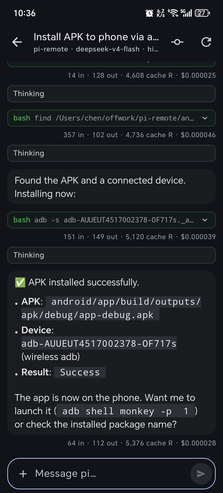

# Pi Remote 📱💻

> **Drive your local [pi](https://github.com/nicedoc/pi) coding agent from your phone — anywhere on the LAN.**

A native **Android app (Kotlin + Jetpack Compose)** that talks to a featherweight **Node.js bridge** on your PC. Browse every session, watch the agent work in real time, and steer it — all from the couch.

<p align="center">
  
  
  
</p>

<p align="center"><em>Connect once → browse everything → chat live. Your agent, in your pocket.</em></p>

---

## ✨ Features

| | |
|---|---|
| 📂 **Projects & Sessions** | Every session on your PC, grouped by working directory — open any one and read its full history instantly |
| ⚡ **Zero-cost browsing** | History is read straight from disk (JSONL). Switching sessions is instant — no agent is spawned just to look |
| 💬 **Live chat** | Streaming responses, thinking blocks, tool calls with **live output**, and per-round token usage |
| ⏹️ **Interrupt & queue** | Stop a running agent with one tap — or send a follow-up that queues politely behind it (`steer` / `followUp`) |
| 🆕 **Per-session model** | Each session picks its own model & thinking level independently, switchable mid-flight |
| 🗜️ **Compact on demand** | Summarize a bloated context from the **+** menu and see how many tokens it freed |
| 📊 **Session spend** | Messages, tokens and dollars for the whole session — one tap from the **+** menu |
| 🖼️ **Image attachments** | Attach screenshots or photos to a prompt, preview the strip, and zoom into full-size results |
| 🌿 **Git at a glance** | Uncommitted changes and commit history with per-file / per-commit diffs, rendered as adaptive tables |
| 🔔 **Background agent** | Leave the app while the agent grinds — a completion notification taps you straight back into the session |
| 👥 **Multi-device live sync** | Several phones can watch the same session; new messages appear on every screen in real time |
| 🌙 **Dark Material 3** | A polished dark-first UI, single-column on phones |

---

## 🚀 Quick Start

### 1 · PC server (one command, npx)

**Recommended** — no clone, no build, run straight from npm (requires Node ≥ 22.19):

```bash
npx pi-remote-bridge       # listens on 0.0.0.0:30150
npx pi-remote-bridge --debug   # log every HTTP request / WebSocket message (troubleshooting)
```


**From source** (for development or a local fork):

```bash
cd server
npm install
npm start
```

First launch prints the connection info and auto-generates a token, along with a **QR code** to pair the phone in one scan:

```
pi-remote-bridge 0.3.1
  URL:   http://192.168.31.117:30150
  Token: 85Ou5U44v-lN0BckrE6QJ5OuMgBAekZQ
  Listening on all interfaces — only use this on a trusted network.
  ...
```

The token lives at `~/.pi/remote/token` (mode `600`) and survives restarts.

### 2 · Android app

```bash
cd android
./gradlew installDebug        # installs on a connected device
```

Or download from github releases.


---

## 📄 License

MIT
